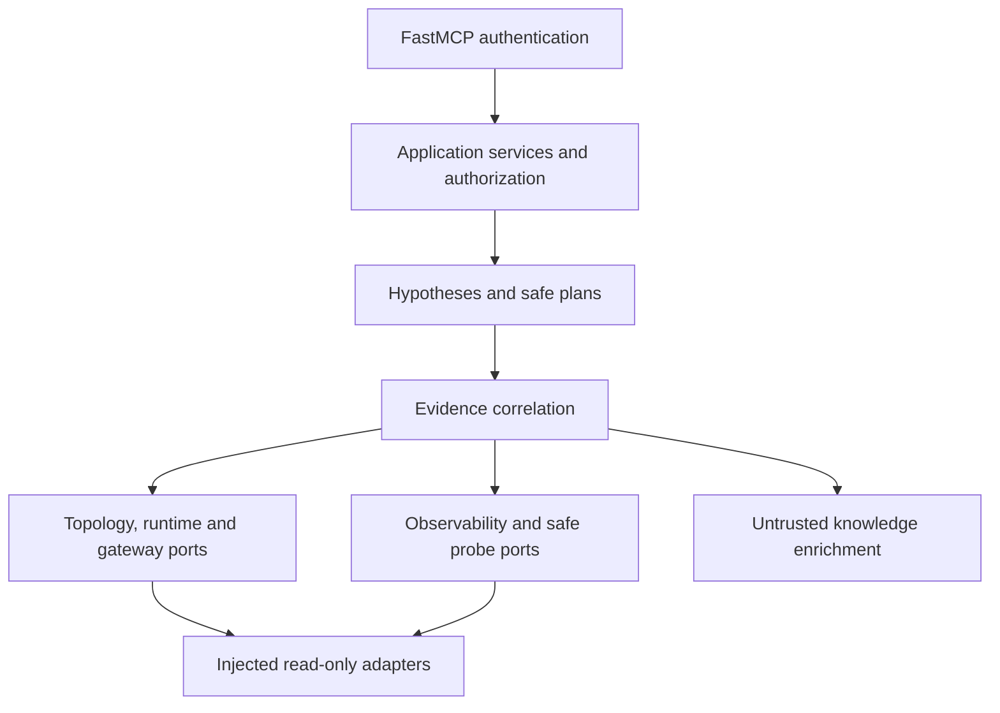

# v1 stable contracts and limits

Configuration schema 1.0.0 rejects unknown fields, duplicate identities and invalid
bindings. YAML is bounded to 256 KiB; duplicate keys/aliases are rejected and
interpolation depth is limited to 30. Lists replace atomically. Config is trusted
operator input; credentials are references. Breaking tool/schema changes after
1.0 require explicit release notes and versioning with migration instructions.

system_health data: server, version, status, uptime_seconds, configured_environment,
registered_gateways, registered_datasources. ToolResponse: ok, request_id,
correlation_id, environment_id, data, error. Failures expose safe categories.
HTTP /livez returns alive/200; /readyz returns healthy/200 or not_ready/503.
Readiness is lifecycle state, not downstream availability. Version comes from
installed package metadata, never Git at runtime.

| Boundary | Default / cap |
|---|---|
| Response bytes | 65,536 / 1,048,576; deployment explicitly uses maximum |
| Application / MCP deadline | 10s / 30s defaults, maximum 300s |
| Kubernetes deadline | 20s default, <=60s and remaining request budget |
| Runtime namespaces / resources per kind | 5 / 100; maximum 20 / 1000 |
| Runtime Events | 50, maximum 200 |
| Runtime graph | 500 nodes, 1000 edges, depth 3; caps 5000 / 10000 / 3 |
| ConfigMap projection bytes | 16 KiB / 64 KiB; values never exported |
| Runtime response bytes | 1 MiB / 4 MiB, bounded before parse |
| Correlation | 10 events, 12 resources/candidates, depth 2 (max 3) |
| Hypotheses / candidates / plan steps | 16 / 8 / 12 |
| Evidence per hypothesis | 10, with source/request bounds also enforced |
| Identifier / text length | 128 / 16,384 characters |
| Observability | 100 items, 12 resources, 8 log lines, 1h window, 256 KiB, 3s/source |
| Cache | 16 entries, 300s TTL; principal/environment scoped |

Metrics and trace observations share item/source budgets. Exact typed schemas are
authoritative. Existing large graph/evidence/log and oversized annotation tests
are resource-safety sanity checks, not a production load benchmark.
External adapters enforce deadlines and bounded reads, without indiscriminate
application retries. Kubernetes rejects exec auth plugins. Prometheus/probes forbid
proxy/TLS bypass; redirects require explicit fresh validation. Timed-out DNS workers
cannot create late connections. Local Git uses fixed argv and timeout.

Core imports no vendor implementation. Candidate references must resolve to
Evidence with provenance; missing/contradictory observations may stay INCONCLUSIVE.
Knowledge/history never becomes current supporting evidence. Plans never execute.
